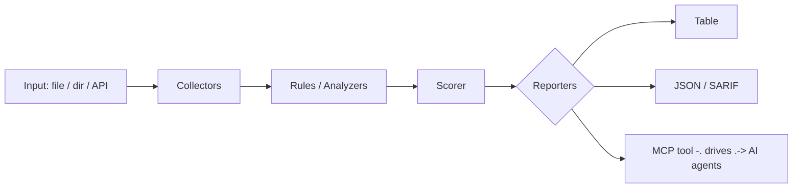

<a name="top"></a>
<div align="center">


# DEEPLINKFUZZ

### Fuzzes Android/iOS deep links, intents, and custom URL schemes against an emulator/device to surface unvalidated-redirect, injection, and component-hijack bugs.


[](https://pypi.org/project/cognis-deeplinkfuzz/) [](https://github.com/cognis-digital/deeplinkfuzz/actions) [](LICENSE) [](https://github.com/cognis-digital)

*Application & Mobile Security — SAST/DAST-lite and binary triage.*

</div>

```bash
pip install "git+https://github.com/cognis-digital/deeplinkfuzz.git"
deeplinkfuzz scan .            # → prioritized findings in seconds
```

<!-- cognis:layman:start -->
## What is this?

DeepLinkFuzz is a security testing tool for Android and iOS apps that checks whether an app's custom URL links (called deep links) can be exploited by attackers. You point it at an app's manifest file, and it automatically generates hundreds of malicious test inputs — such as SQL injection attempts, path traversal attacks, and command injection strings — then checks which ones the app would accept without proper validation. It produces a prioritized report of vulnerabilities so developers and security teams can fix dangerous entry points before shipping. It is aimed at mobile app developers, security engineers, and penetration testers who want fast, automated coverage of a common but often-overlooked mobile attack surface.
<!-- cognis:layman:end -->

## Contents

- [Why deeplinkfuzz?](#why) · [Features](#features) · [Quick start](#quick-start) · [Example](#example) · [Architecture](#architecture) · [AI stack](#ai-stack) · [How it compares](#how-it-compares) · [Integrations](#integrations) · [Install anywhere](#install-anywhere) · [Related](#related) · [Contributing](#contributing)

<a name="why"></a>
## Why deeplinkfuzz?

Deep-link/intent vulns are a top mobile bug-bounty payout class with no dedicated fuzzer; deeplinkfuzz auto-enumerates exported entry points and replays mutated payloads in CI.

`deeplinkfuzz` is single-purpose, scriptable, and self-hostable: point it at a target, get prioritized results in the format your workflow already speaks (table · JSON · SARIF), gate CI on it, and let agents drive it over MCP.

<div align="right"><a href="#top">↑ back to top</a></div>

<a name="features"></a>
## Features

- ✅ Parse Manifest
- ✅ Enumerate Entry Points
- ✅ Build Deep Link
- ✅ Mutate
- ✅ Detect Vulnerabilities
- ✅ Fuzz Manifest
- ✅ Runs on Linux/macOS/Windows · Docker · devcontainer
- ✅ Ports in Python, JavaScript, Go, and Rust (`ports/`)

<div align="right"><a href="#top">↑ back to top</a></div>

<a name="quick-start"></a>
<!-- cognis:install:start -->
## Install

`deeplinkfuzz` is source-available (not published to PyPI) — every method below installs
straight from GitHub. Pick whichever you prefer; the one-line scripts auto-detect
the best tool available on your machine.

**One-liner (Linux / macOS):**
```sh
curl -fsSL https://raw.githubusercontent.com/cognis-digital/deeplinkfuzz/HEAD/install.sh | sh
```

**One-liner (Windows PowerShell):**
```powershell
irm https://raw.githubusercontent.com/cognis-digital/deeplinkfuzz/HEAD/install.ps1 | iex
```

**Or install manually — any one of:**
```sh
pipx install "git+https://github.com/cognis-digital/deeplinkfuzz.git"     # isolated (recommended)
uv tool install "git+https://github.com/cognis-digital/deeplinkfuzz.git"  # uv
pip install "git+https://github.com/cognis-digital/deeplinkfuzz.git"      # pip
```

**From source:**
```sh
git clone https://github.com/cognis-digital/deeplinkfuzz.git
cd deeplinkfuzz && pip install .
```

Then run:
```sh
deeplinkfuzz --help
```
<!-- cognis:install:end -->

## Quick start

```bash
pip install "git+https://github.com/cognis-digital/deeplinkfuzz.git"
deeplinkfuzz --version
deeplinkfuzz scan .                       # scan current project
deeplinkfuzz scan . --format json         # machine-readable
deeplinkfuzz scan . --fail-on high        # CI gate (non-zero exit)
```

<div align="right"><a href="#top">↑ back to top</a></div>

<a name="example"></a>
## Example

```text
$ deeplinkfuzz scan .
  [HIGH    ] DEE-001  example finding             (./src/app.py)
  [MEDIUM  ] DEE-002  another signal              (./config.yaml)

  2 findings · risk score 5 · 38ms
```

<div align="right"><a href="#top">↑ back to top</a></div>

<a name="architecture"></a>
## Architecture



<div align="right"><a href="#top">↑ back to top</a></div>

<a name="ai-stack"></a>
## Use it from any AI stack

`deeplinkfuzz` is interoperable with every popular way of using AI:

- **MCP server** — `deeplinkfuzz mcp` (Claude Desktop, Cursor, Cognis.Studio, [uncensored-fleet](https://github.com/cognis-digital/uncensored-fleet))
- **OpenAI-compatible / JSON** — pipe `deeplinkfuzz scan . --format json` into any agent or LLM
- **LangChain · CrewAI · AutoGen · LlamaIndex** — wrap the CLI/JSON as a tool in one line
- **CI / scripts** — exit codes + SARIF for non-AI pipelines

<div align="right"><a href="#top">↑ back to top</a></div>

<a name="how-it-compares"></a>
## How it compares

| | **Cognis deeplinkfuzz** | Drozer (Android attack surface) + scheme-fuzzing techniques from mobile pentest playbooks |
|---|:---:|:---:|
| Self-hostable, no account | ✅ | varies |
| Single command, zero config | ✅ | ⚠️ |
| JSON + SARIF for CI | ✅ | varies |
| MCP-native (AI agents) | ✅ | ❌ |
| Polyglot ports (JS/Go/Rust) | ✅ | ❌ |
| Open license | ✅ COCL | varies |

*Built in the spirit of **Drozer (Android attack surface) + scheme-fuzzing techniques from mobile pentest playbooks**, re-framed the Cognis way. Missing a credit? Open a PR.*

<div align="right"><a href="#top">↑ back to top</a></div>

<a name="integrations"></a>
## Integrations

Pipes into your stack: **SARIF** for code-scanning, **JSON** for anything, an **MCP server** (`deeplinkfuzz mcp`) for AI agents, and a webhook forwarder for SIEM/Slack/Jira. See [`docs/INTEGRATIONS.md`](docs/INTEGRATIONS.md).

<div align="right"><a href="#top">↑ back to top</a></div>

<a name="install-anywhere"></a>
## Install — every way, every platform

```bash
pip install "git+https://github.com/cognis-digital/deeplinkfuzz.git"    # pip (works today)
pipx install "git+https://github.com/cognis-digital/deeplinkfuzz.git"   # isolated CLI
uv tool install "git+https://github.com/cognis-digital/deeplinkfuzz.git" # uv
pip install cognis-deeplinkfuzz                                          # PyPI (when published)
docker run --rm ghcr.io/cognis-digital/deeplinkfuzz:latest --help        # Docker
brew install cognis-digital/tap/deeplinkfuzz                             # Homebrew tap
curl -fsSL https://raw.githubusercontent.com/cognis-digital/deeplinkfuzz/main/install.sh | sh
```

| Linux | macOS | Windows | Docker | Cloud |
|---|---|---|---|---|
| `scripts/setup-linux.sh` | `scripts/setup-macos.sh` | `scripts/setup-windows.ps1` | `docker run ghcr.io/cognis-digital/deeplinkfuzz` | [DEPLOY.md](docs/DEPLOY.md) (AWS/Azure/GCP/k8s) |

<div align="right"><a href="#top">↑ back to top</a></div>

<a name="related"></a>
## Related Cognis tools

- [`apkpeek`](https://github.com/cognis-digital/apkpeek) — One-command static triage of Android APK/AAB binaries: surfaces hardcoded secrets, exported components, dangerous permissions, and insecure manifest flags as a single SARIF report.
- [`ipasnitch`](https://github.com/cognis-digital/ipasnitch) — Static scanner for iOS .ipa bundles that flags ATS exceptions, missing entitlements hardening, embedded URLs/secrets, and weak Info.plist transport settings.
- [`hookcraft`](https://github.com/cognis-digital/hookcraft) — Generates ready-to-run Frida instrumentation scripts from a YAML intent (e.g. 'bypass SSL pinning', 'dump crypto keys') and verifies they attach to a target process.
- [`dastlite`](https://github.com/cognis-digital/dastlite) — A headless, config-as-code DAST runner that crawls an authenticated web/mobile-API surface and fires a curated active-scan ruleset, emitting deduplicated SARIF.
- [`semsift`](https://github.com/cognis-digital/semsift) — Lightweight semantic-aware SAST that runs curated taint rules over diffs only, so PRs get fast incremental SAST instead of whole-repo scan fatigue.
- [`cheatsense`](https://github.com/cognis-digital/cheatsense) — Anti-cheat telemetry analyzer that ingests game session logs and flags statistically anomalous input/aim/movement signatures with explainable per-flag scoring.

**Explore the suite →** [🗂️ all 170+ tools](https://github.com/cognis-digital/cognis-neural-suite) · [⭐ awesome-cognis](https://github.com/cognis-digital/awesome-cognis) · [🔗 cognis-sources](https://github.com/cognis-digital/cognis-sources) · [🤖 uncensored-fleet](https://github.com/cognis-digital/uncensored-fleet) · [🧠 engram](https://github.com/cognis-digital/engram)

<div align="right"><a href="#top">↑ back to top</a></div>

<a name="contributing"></a>
## Contributing

PRs, new rules, and demo scenarios are welcome under the collaboration-pull model — see [CONTRIBUTING.md](CONTRIBUTING.md) and [SECURITY.md](SECURITY.md).

> ### ⭐ If `deeplinkfuzz` saved you time, **star it** — it genuinely helps others find it.

## License

Source-available under the **Cognis Open Collaboration License (COCL) v1.0** — free for personal, internal-evaluation, research, and educational use; **commercial / production use requires a license** (licensing@cognis.digital). See [LICENSE](LICENSE).

---

<div align="center"><sub><b><a href="https://cognis.digital">Cognis Digital</a></b> · one of 170+ tools in the <a href="https://github.com/cognis-digital/cognis-neural-suite">Cognis Neural Suite</a> · <i>Making Tomorrow Better Today</i></sub></div>
